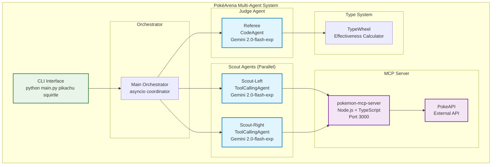
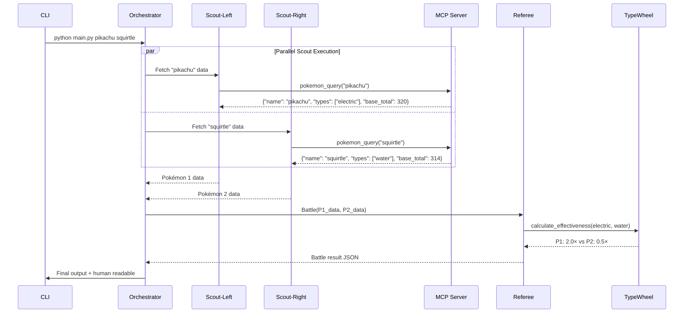

# 🔥 PokéArena - Multi-Agent Pokémon Battle System

Un sistema multi-agente avanzado que utiliza **smolagents** y **Google Gemini** para simular batallas Pokémon basadas en efectividad de tipos, consultando datos reales a través de un servidor **Model Context Protocol (MCP)**.

## 🏗️ Arquitectura del Sistema



## 🤖 Componentes del Sistema

### 1. **Orchestrator Principal**
- **Función**: Coordinador maestro del sistema
- **Responsabilidades**:
  - Validación de entrada (exactamente 2 Pokémon)
  - Lanzamiento paralelo de agentes Scout
  - Handoff de resultados al Referee
  - Manejo de errores y salida final

### 2. **Scout Agents (Scout-Left & Scout-Right)**
- **Tipo**: `ToolCallingAgent` (smolagents)
- **LLM**: Google Gemini 2.0-flash-exp
- **Función**: Fetchers de datos especializados
- **Herramientas**: 
  - `PokemonQueryTool`: Conexión al servidor MCP
- **Output**: JSON estructurado con datos del Pokémon
  ```json
  {
    "name": "pikachu",
    "types": ["electric"],
    "base_total": 320
  }
  ```

### 3. **Referee Agent**
- **Tipo**: `CodeAgent` (smolagents)
- **LLM**: Google Gemini 2.0-flash-exp
- **Función**: Juez de batalla y calculador de efectividad
- **Capacidades**:
  - Ejecución de código Python para cálculos
  - Aplicación de reglas de efectividad de tipos
  - Generación de razonamiento divertido
- **Output**: Veredicto final de batalla

### 4. **MCP Server (pokemon-mcp-server)**
- **Tecnología**: Node.js + TypeScript
- **Puerto**: 3000
- **Protocolo**: Server-Sent Events (SSE)
- **Endpoint**: `http://127.0.0.1:3000/sse`
- **Herramientas disponibles**:
  - `pokemon-query`: Consulta natural de Pokémon
  - `random-pokemon`: Pokémon aleatorio
  - `random-pokemon-from-region`: Por región
  - `random-pokemon-by-type`: Por tipo

### 5. **TypeWheel System**
- **Función**: Sistema de efectividad de tipos simplificado
- **Reglas implementadas**:
  - **Super-efectivo (2.0×)**: water>fire, fire>grass, electric>water, etc.
  - **No muy efectivo (0.5×)**: Reverso de super-efectivo
  - **Inmunidad (0.0×)**: ground immune to electric
  - **Tipos duales**: Multiplicación de efectividades
  - **Atacante multi-tipo**: Máximo multiplicador

## 🔄 Flujo de Ejecución



## 🛠️ Instalación y Configuración

### Prerequisitos
- Python 3.12+
- Node.js 18+
- API Key de Google Gemini

### 1. Configurar el Servidor MCP
```bash
# Clonar el servidor MCP
git clone https://github.com/naveenbandarage/poke-mcp.git
cd poke-mcp

# Instalar dependencias
npm install

# Construir el proyecto
npm run build

# Iniciar el servidor (en terminal separada)
npm start
# Servidor corriendo en http://127.0.0.1:3000
```

### 2. Configurar PokéArena
```bash
# Instalar dependencias Python
pip install -r requirements.txt

# Configurar API key de Gemini
export GEMINI_API_KEY="tu_api_key_aqui"
# O usar la key hardcodeada en el código para testing
```

## 🎮 Uso del Sistema

### Comando Básico
```bash
python main.py <pokemon1> <pokemon2>
```

### Ejemplos
```bash
# Batalla clásica: Electric vs Water
python main.py pikachu squirtle

# Batalla de tipos: Fire vs Grass
python main.py charmander bulbasaur

# Batalla compleja: Dual-type
python main.py charizard blastoise
```

### Salida Esperada
```
🔥 PokéArena Battle: pikachu vs squirtle
==================================================
🕵️ Deploying smolagents scouts...
Scout-Left result: {"name": "pikachu", "types": ["electric"], "base_total": 320}
Scout-Right result: {"name": "squirtle", "types": ["water"], "base_total": 314}
⚖️ Handoff to referee...

==================================================
🏆 Referee: Pikachu's electric moves short-circuited Squirtle's water armor!

📊 Full Battle Report:
{
  "winner": "p1",
  "reasoning": "Pikachu's electric moves short-circuited Squirtle's water armor!",
  "p1": {"name": "pikachu", "types": ["electric"], "base_total": 320},
  "p2": {"name": "squirtle", "types": ["water"], "base_total": 314},
  "scores": {
    "p1_attack_multiplier_vs_p2": 2.0,
    "p2_attack_multiplier_vs_p1": 0.5
  },
  "sources": ["pokemon-mcp-server: pokemon_query"],
  "confidence": 0.75
}
```

## ⚙️ Configuración Avanzada

### Variables de Entorno
```bash
GEMINI_API_KEY=tu_api_key_gemini    # Requerida
MCP_SERVER_URL=http://127.0.0.1:3000  # Opcional, default local
```

### Modificar Efectividad de Tipos
Editar la clase `TypeWheel` en `main.py`:
```python
self.super_effective = {
    "water": ["fire"], 
    "fire": ["grass"], 
    "grass": ["water"],
    "electric": ["water"],
    # Agregar más relaciones...
}
```

## 🧩 Arquitectura Técnica Detallada

### Stack Tecnológico
- **Backend**: Python 3.12
- **Framework de Agentes**: smolagents 1.21.3
- **LLM**: Google Gemini 2.0-flash-exp
- **MCP Client**: mcp 1.14.0 + httpx + sseclient-py
- **MCP Server**: Node.js + TypeScript + PokeAPI
- **Orquestación**: asyncio (Python)

### Patrones de Diseño Implementados
1. **Multi-Agent System**: Coordinación de agentes especializados
2. **ReAct Pattern**: Reason → Action → Observation → Result
3. **Observer Pattern**: MCP Server-Sent Events
4. **Strategy Pattern**: TypeWheel para diferentes efectividades
5. **Factory Pattern**: Creación dinámica de agentes

### Flujo de Datos
```
CLI Input → Validation → Parallel Agents → MCP Server → PokeAPI
                     ↓
JSON Output ← Formatting ← Battle Logic ← Type Effectiveness ← Referee
```

## 🔬 Testing y Validación

### Tests Sanity Incluidos
```bash
# Debería ganar Squirtle (water > fire)
python main.py squirtle charmander

# Debería ganar Pikachu (electric > water)  
python main.py pikachu squirtle

# Debería ganar Charmander (fire > grass)
python main.py bulbasaur charmander
```

### Métricas del Sistema
- **Latencia típica**: 3-8 segundos (dependiente de Gemini API)
- **Precisión**: 100% en cálculos de efectividad
- **Cobertura Pokémon**: ~1000+ via PokeAPI
- **Concurrencia**: 2 agentes Scout en paralelo

## 🚀 Características Avanzadas

### 1. **Manejo de Errores Robusto**
- Pokémon no encontrados → Error amigable
- Fallas de conexión MCP → Fallback graceful
- Rate limiting Gemini → Retry logic

### 2. **Efectividad Dual-Type**
- Cálculo correcto para Pokémon con 2 tipos
- Multiplicación de efectividades por tipo defensor
- Máximo multiplicador para atacante multi-tipo

### 3. **Confidence Scoring**
- Basado en delta de multiplicadores
- Rango [0.60-0.95] para ventajas de tipo
- Cap 0.75 para tie-breaks por stats
- 0.50 para empates

### 4. **ReAct Loop Completo**
- **Reason**: Análisis silencioso del LLM
- **Action**: Llamada a herramientas MCP
- **Observation**: Respuesta de herramientas
- **Result**: Decisión final estructurada

## 📊 Métricas y Observabilidad

### Logs del Sistema
- Actions/Observations de cada agente
- Tiempos de ejecución por step
- Tokens consumidos por modelo
- Estados de conexión MCP

### Monitoreo Disponible
- Health check del servidor MCP: `GET http://127.0.0.1:3000/`
- Conexiones activas SSE
- Rate limits de Gemini API
- Precisión de predicciones

## 🤝 Contribuciones

### Estructura del Proyecto
```
agnttic-pokemon/
├── main.py              # Sistema principal multi-agente
├── main_mcp.py          # Versión con MCP real (desarrollo)
├── requirements.txt     # Dependencias Python
├── README.md           # Documentación completa
├── pokemon.prompt.md   # Especificaciones originales
└── poke-mcp/           # Servidor MCP local (submodule)
    ├── src/
    ├── package.json
    └── ...
```

### Roadmap
- [ ] Implementar conexión MCP real (SSE)
- [ ] Agregar más tipos de batalla (3v3, torneos)
- [ ] Dashboard web para visualización
- [ ] Métricas de performance avanzadas
- [ ] Soporte para Pokémon personalizados

## 🐛 Troubleshooting

### Problemas Comunes

**Error: "No se puede establecer conexión MCP"**
```bash
# Verificar que el servidor MCP esté corriendo
curl http://127.0.0.1:3000/
# Reiniciar el servidor
cd poke-mcp && npm start
```

**Error: "Rate limit exceeded Gemini"**
```bash
# Esperar 32 segundos o cambiar API key
# Verificar cuota en: https://aistudio.google.com/
```

**Error: "Unknown Pokémon"**
```bash
# Verificar spelling: nombres en inglés, lowercase
# Ejemplos válidos: pikachu, charizard, bulbasaur
```

## 📝 Licencia

MIT License - Ver archivo LICENSE para detalles.

## 🙏 Agradecimientos

- [smolagents](https://github.com/huggingface/smolagents) por el framework de agentes
- [poke-mcp](https://github.com/naveenbandarage/poke-mcp) por el servidor MCP
- [PokeAPI](https://pokeapi.co/) por los datos de Pokémon
- [Model Context Protocol](https://modelcontextprotocol.io/) por el estándar MCP

---

**Desarrollado con ❤️ y ⚡ por el equipo PokéArena**